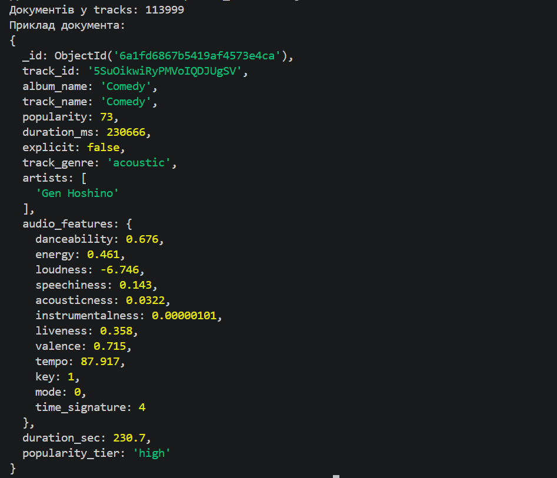
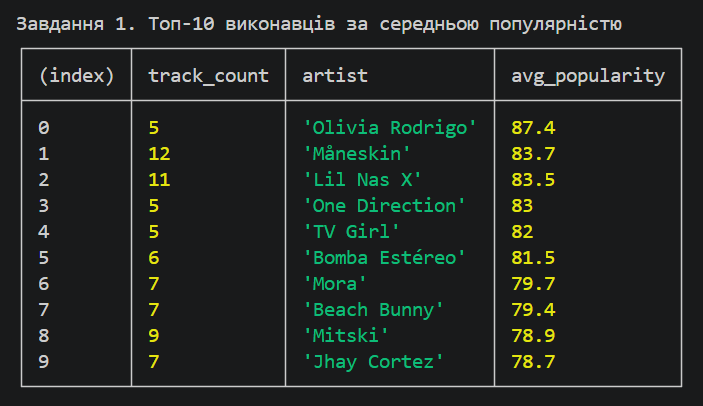
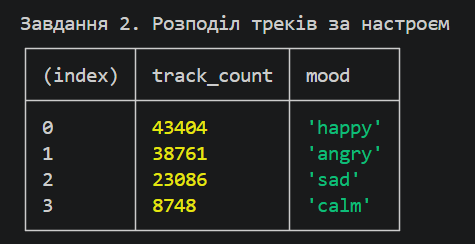
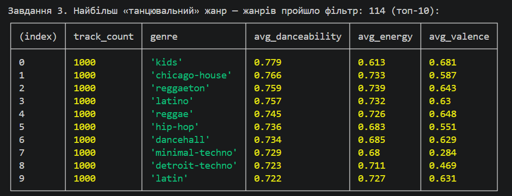
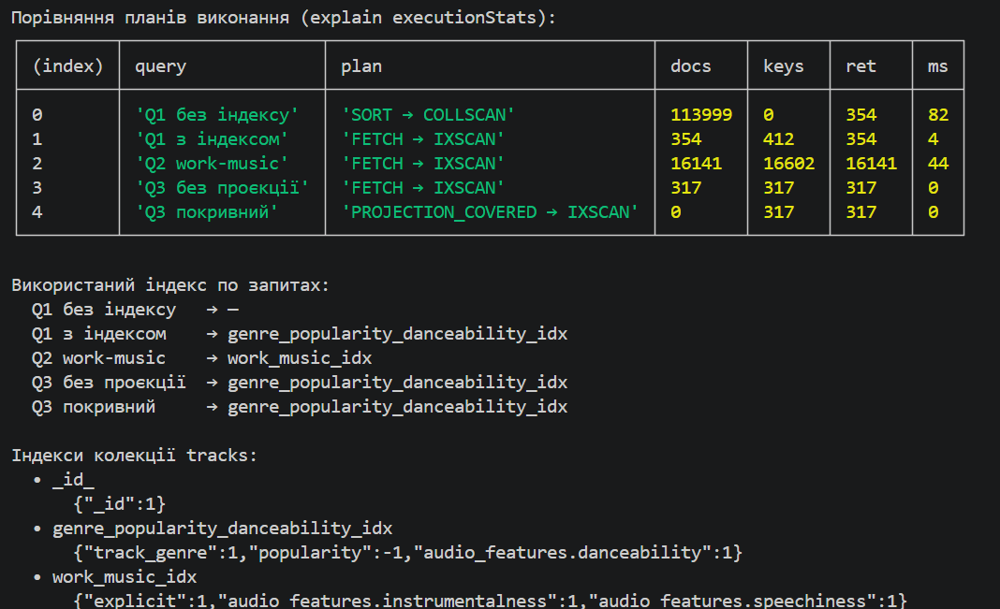

# Завдання 1 — аналітична платформа для музичного стрімінгового сервісу

Навчальний проєкт з MongoDB (NoSQL) на датасеті Spotify (114k треків).

## Структура

```text
.
├── .env                        # MONGO_URI, DB_NAME (НЕ комітити!)
├── requirements.txt
├── scripts/
│   ├── 01_load_data.py         # CSV → tracks_raw
│   └── 02_transform.js         # tracks_raw → tracks (aggregation)
├── queries/
│   ├── part2_queries.js        # Частина 2 — запити
│   ├── part3_aggregations.js   # Частина 3 — аналітика
│   └── part4_indexes.js        # Частина 4 — індекси
└── README.md
```

## Передумови

- **Python 3.12**, **MongoDB Shell** (`mongosh`), кластер **MongoDB Atlas**.
- Датасет [Spotify Tracks Dataset](https://www.kaggle.com/datasets/maharshipandya/spotify-tracks-dataset)
  — файл `dataset.csv` покласти в корінь проєкту (вручну зі сторінки Kaggle або
  `kaggle datasets download -d maharshipandya/spotify-tracks-dataset --unzip`).

## Налаштування оточення та запуск

```powershell
# 1. Віртуальне середовище + залежності
python -m venv .venv
.\.venv\Scripts\Activate.ps1
pip install -r requirements.txt

# 2. Створити .env у корені проєкту:
#   MONGO_URI=mongodb+srv://<user>:<pass>@<cluster>.mongodb.net/?appName=Cluster0
#   DB_NAME=spotify

# 3. Покласти dataset.csv у корінь (див. «Передумови»)

# 4. Порядок запуску скриптів
.\.venv\Scripts\python.exe scripts\01_load_data.py     # CSV → tracks_raw
mongosh $env:MONGO_URI --file scripts\02_transform.js  # tracks_raw → tracks (113 999 док.)
mongosh $env:MONGO_URI --file queries\part2_queries.js       # Частина 2
mongosh $env:MONGO_URI --file queries\part3_aggregations.js  # Частина 3
mongosh $env:MONGO_URI --file queries\part4_indexes.js       # Частина 4
```

`01_load_data.py` завантажує CSV у проміжну колекцію `tracks_raw` (плоска
структура), а `02_transform.js` агрегацією формує цільову колекцію `tracks`.

## Схема даних (колекція `tracks`)

Скрипт `02_transform.js` трансформує плоский `tracks_raw` у документоорієнтовану
схему: рядок виконавців `"A;B"` → масив `artists`; 12 аудіофіч згруповано у
вкладений об'єкт `audio_features`; додано обчислювані `duration_sec` і
`popularity_tier`; прибрано сирий рядок артистів та плоскі аудіофічі.

| Поле | Тип | Опис |
|---|---|---|
| `track_id` | string | ідентифікатор треку |
| `track_name`, `album_name` | string | назва треку / альбому |
| `artists` | string[] | масив виконавців |
| `track_genre` | string | жанр |
| `popularity` | int | популярність 0–100 |
| `duration_ms` | int | тривалість, мс |
| `explicit` | bool | наявність explicit-контенту |
| `audio_features` | object | 12 аудіохарактеристик (див. нижче) |
| `duration_sec` | double | тривалість у секундах (обчислюване, 1 знак) |
| `popularity_tier` | string | `high` ≥70 / `medium` 40–69 / `low` <40 (обчислюване) |

`audio_features`: `danceability`, `energy`, `loudness`, `speechiness`,
`acousticness`, `instrumentalness`, `liveness`, `valence`, `tempo`, `key`,
`mode`, `time_signature`.

Приклад документа:

```json
{
  "_id": "6a1fd6867b5419af4573e4ca",
  "track_id": "5SuOikwiRyPMVoIQDJUgSV",
  "album_name": "Comedy",
  "track_name": "Comedy",
  "popularity": 73,
  "duration_ms": 230666,
  "explicit": false,
  "track_genre": "acoustic",
  "artists": ["Gen Hoshino"],
  "audio_features": {
    "danceability": 0.676,
    "energy": 0.461,
    "loudness": -6.746,
    "speechiness": 0.143,
    "acousticness": 0.0322,
    "instrumentalness": 0.00000101,
    "liveness": 0.358,
    "valence": 0.715,
    "tempo": 87.917,
    "key": 1,
    "mode": 0,
    "time_signature": 4
  },
  "duration_sec": 230.7,
  "popularity_tier": "high"
}
```

---

## Відповіді на теоретичні питання

## Частина 1 — Схема

**1. Чому аудіофічі винесені в окремий об'єкт `audio_features`?**
Це логічно зв'язана група (всі описують «звучання» й використовуються разом).
Вкладення дає семантичне групування, зручність роботи блоком (одна проєкція замість
12 полів) і чистіший верхній рівень для частих фільтрів (`popularity`, `genre`).
*Вигідно* для природних 1:1-груп фіксованого розміру. *Проблемно* за глибокої
вкладеності (складніші запити/індекси через крапкову нотацію), при зростаючих
масивах (ліміт документа 16 МБ) і коли підгрупа оновлюється окремо.

**2. Чому виконавці — масив, а не рядок?**
Масив коректно моделює many-to-many («трек ↔ багато артистів») і не вимагає парсити
рядок щоразу. Спрощує: пошук за артистом `find({ artists: "X" })` (без regex і без
хибних підрядків), оператори `$all`/`$in`/`$size`, агрегації `$unwind`+`$group` по
артистах, а також multikey-індекс по `artists`.

**3. `$out` vs `$merge`?**
Обидва пишуть результат пайплайна в колекцію.
`$out` — повністю **замінює** колекцію (скидає її вміст та індекси). Для повної
перебудови «з нуля» (наш `02_transform.js`).
`$merge` — **інкрементальне злиття** за ключем (`whenMatched`/`whenNotMatched`),
не чіпає документи поза виводом, зберігає індекси, вміє upsert. Для матеріалізованих
в'ю/звітів, які періодично доливаються.

## Частина 2 — Запити

**1. `$unwind`** розгортає масив із N елементів у N окремих документів (по одному
елементу в кожному). Це дозволяє групувати/фільтрувати за окремими елементами —
у Завданні 2 робимо `$unwind: "$artists"`, щоб рахувати статистику по кожному артисту.

**2. `$stdDevPop` vs `$stdDevSamp`** — стандартне відхилення з діленням на **N**
(генеральне, вся сукупність) проти **N−1** (вибіркове, поправка Бесселя; для одного
значення → `null`). У Завданні 3 беремо всі треки жанру як повну сукупність → `$stdDevPop`.

Структура документа в колекції `tracks` (113 999 док.), на якій виконуються запити:



## Частина 3 — Агрегації

**1. Поріг кількості треків артиста (1 vs >50).**
З 29 858 артистів 13 098 (≈44%) мають 1 трек, лише 355 — понад 50; глобальна
середня популярність ≈ 33,2.

- *Поріг = 1*: кваліфікуються всі; топ заповнять «одноразові» з єдиним випадково
  популярним треком (середнє по одному значенню = шум). Поріг ≥5 відсікає ці викиди.
- *Поріг > 50*: лишаються ~355 продуктивних артистів; середнє регресує до ~33, тож
  верх очолюють стабільні (The Neighbourhood 75,6; Halsey 71,5; BTS 68,9) замість
  піків ~87. Надійніше, але «згладжено».

**2. Поріг жанрів (100 vs 50).**
**Не зміниться.** Усі 114 жанрів мають ~1000 треків (min 999), тож `below100 = 0`
і `below50 = 0` — обидва пороги пропускають усі жанри. Фільтр тут «холостий»,
запобіжник на випадок незбалансованих даних.

Результати запитів:

Завдання 1 — топ-10 виконавців за середньою популярністю:



Завдання 2 — розподіл треків за настроєм:



Завдання 3 — найбільш «танцювальні» жанри (топ-10):



## Частина 4 — Індекси

Індекс для Завдання 1 за правилом **ESR** (Equality → Sort → Range):
`{ track_genre: 1, popularity: -1, "audio_features.danceability": 1 }`.

**1. Що змінилося в плані виконання?**

| `explain()` | ДО | ПІСЛЯ |
|---|---|---|
| Стадії | `SORT → COLLSCAN` | `FETCH → IXSCAN` |
| `totalDocsExamined` | 113 999 | 354 |
| `executionTimeMillis` | 135 | 2 |

`COLLSCAN → IXSCAN` (база читає лише гілку `pop` + потрібний діапазон), зникла
блокуюча `SORT` (порядок дає сам індекс `popularity:-1`), `docsExamined` 113 999 → 354
(= `nReturned`), час ~у 65× менший.

**2. Як зрозуміти, що індекс використовується?**
У `winningPlan` стадія **`IXSCAN`** (не `COLLSCAN`) і присутнє поле **`indexName`**
(`genre_popularity_danceability_idx`); **`totalDocsExamined ≈ nReturned`** (354 ≈ 354,
а не розмір колекції); немає окремої стадії `SORT`.

**Завдання 2.** Складений індекс `{ explicit: 1, "audio_features.instrumentalness": 1,
"audio_features.speechiness": 1 }` (ESR: рівність → діапазони). `explain` пошуку:
`FETCH → IXSCAN`, `indexName = work_music_idx`, `keysExamined` 16 602 ≈ `nReturned`
16 141 — індекс задіяний і ефективний.

**Завдання 3. Чи покривний запит `find({ track_genre: "pop", popularity: { $gte: 70 } })`?**
**Ні.** Покривний запит виконується лише за індексом (без `FETCH`, `totalDocsExamined = 0`)
за умови, що і поля фільтра, і поля у виводі є в індексі. Тут фільтр покривається
префіксом індексу, але `find()` **без проєкції** повертає документи цілком (поля
поза індексом + `_id`), тому потрібен `FETCH` — `explain` показує `FETCH → IXSCAN`,
`totalDocsExamined = 317`.
Щоб зробити покривним — додати проєкцію лише на поля індексу й виключити `_id`:
`find({...}, { _id: 0, track_genre: 1, popularity: 1 })` → план `PROJECTION_COVERED → IXSCAN`,
`totalDocsExamined = 0`.

Порівняння планів виконання всіх запитів (`explain("executionStats")`):


